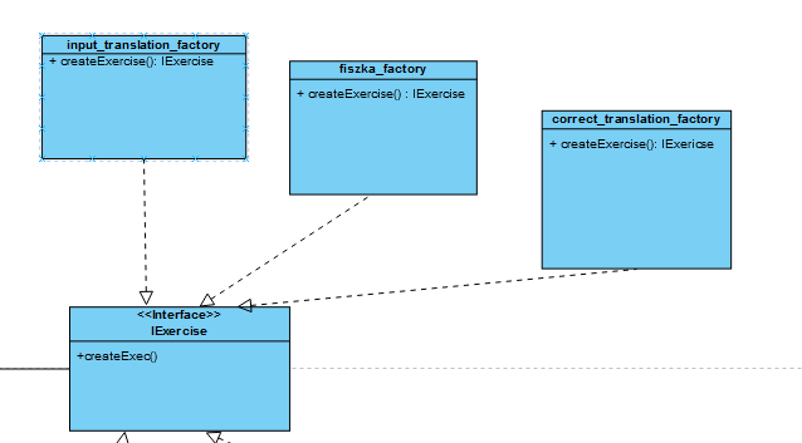

# Aplikacja do nauki języka 

Aplikacja umożliwia użytkownikowi przyswajanie słownictwa i sprawdzanie swojej wiedzy w trybach takich jak fiszki
(wyświetlanie słowa lub tłumaczenia z oczekiwaniem na odpowiedź użytkownika i prezentacja poprawnej odpowiedzi), wybór
poprawnego tłumaczenia spośród kilku opcji, samodzielne wpisywania tłumaczenia. Aplikacja zachęca do regularnej nauki
przy pomocy codziennych wyzwań i umożliwia powtórki słów, z którymi użytkownik miał problemy. Testy wiedzy pozwalają
sprawdzić znajomość słów na podstawie wybranych zestawów. Użytkownik może tworzyć zestawy słówek, grupować je w
kategorie (np. „Podróże”, „Zakupy”), śledzić postępy w nauce i generować raporty. Aplikacja oferuje eksport
i import danych.

### Wszystkie pliki robocze projektu znajdują się w następującej ścieżce: `land/src`

## Diagram klas UML

## Wzorzec kreacyjny - Factory Method

*Wzorzec Factory Method umożliwia tworzenie obiektów różnych typów bez bezpośredniego określania ich klas. W aplikacji
klasa ExerciseFactory definiuje metodę createExercise(), która jest implementowana w klasach konkretnych (fiszka_factory,
input_translation_factory, correct_translation_factory). Dzięki temu aplikacja może dynamicznie tworzyć odpowiedni typ
ćwiczenia w zależności od potrzeby.*

## Wzorzec strukturalny - Proxy

*Proxy jest wzorcem stosowanym do kontroli dostępu do obiektu. W aplikacji ProxyExercise działa jako zastępca dla
Exercise, przechowując cache wyników (słów i odpowiedzi). Dzięki temu aplikacja może unikać ponownego przetwarzania już
istniejących danych.*

## Wzorzec strukturalny - Adapter

*Adapter pozwala na integrację klas o niekompatybilnych interfejsach. W aplikacji klasa DataAdapter umożliwia współpracę
z istniejącym systemem zarządzania danymi (LegacyDataHandler), obsługując funkcje eksportu do PDF oraz importu z
innych formatów.*

## Wzorzec behawioralny - Memento

*Wzorzec Memento jest używany do zapisywania i przywracania stanu obiektu. W aplikacji klasa Memento przechowuje stan,
a Originator odpowiada za jego zapis i przywracanie. Klasa Application może w ten sposób odtworzyć wcześniejszy stan
nauki użytkownika (np. w przypadku przerwania ćwiczeń).*

## Wzorzec behawioralny - State

*Wzorzec State pozwala na zmianę zachowania obiektu w zależności od jego stanu. W aplikacji klasa Daily_exercise
korzysta z obiektów reprezentujących różne stany ćwiczeń (rozpoczęte, przerwane, zakończone). Każdy stan implementuje
metodę handle(), umożliwiającą obsługę specyficzną dla danego etapu ćwiczenia.*
